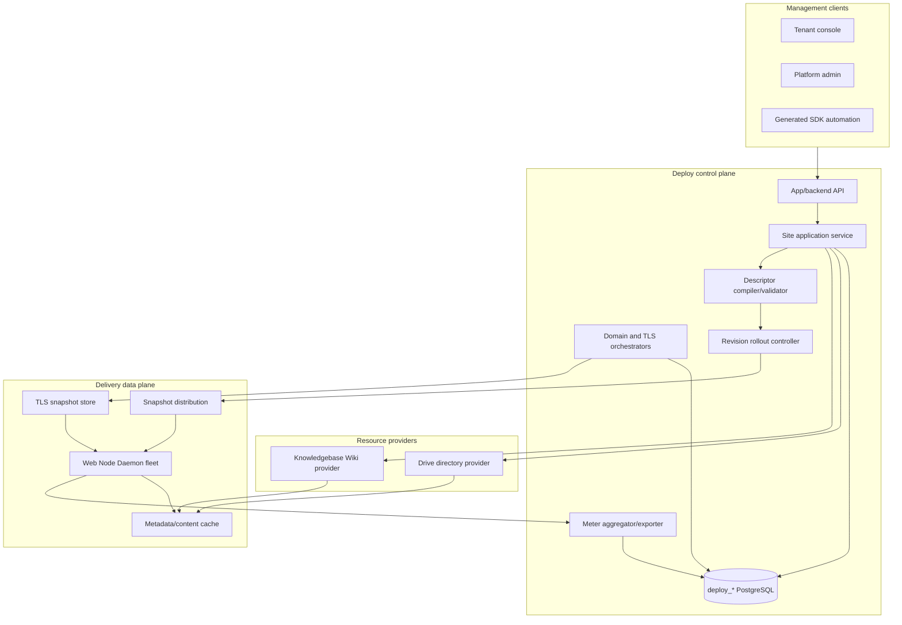
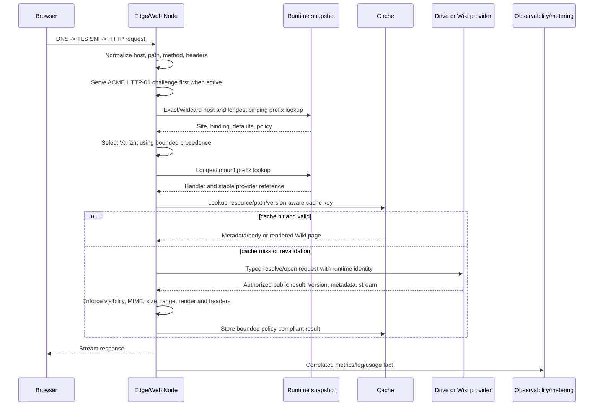
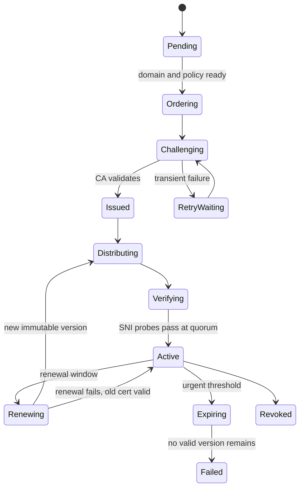

# SDKWork Cloud Site Publishing Control-Plane Architecture

Status: implementation in progress
Owner: SDKWork Deploy maintainers
Updated: 2026-07-23
Requirement: REQ-2026-0001
Decisions: ADR-20260721-unified-cloud-site-publishing-control-plane,
ADR-20260723-managed-domain-tls-control-plane (proposed)
Specs: ARCHITECTURE_DECISION_SPEC.md, DOMAIN_SPEC.md, DATABASE_SPEC.md, DRIVE_SPEC.md,
API_SPEC.md, SDK_SPEC.md, APP_SDK_INTEGRATION_SPEC.md, CONFIG_SPEC.md, DEPLOYMENT_SPEC.md,
NGINX_SPEC.md, SECURITY_SPEC.md, PRIVACY_SPEC.md, PERFORMANCE_SPEC.md,
OBSERVABILITY_SPEC.md, TEST_SPEC.md, RELEASE_SPEC.md, MIGRATION_SPEC.md

## Implementation Evidence

The prelaunch control plane now has executable foundations rather than a Release-only design:

- portable PostgreSQL and SQLite baseline tables for Site resources, Variants, rules, Mounts,
  Bindings, immutable Site revisions, Web Node targets, and durable runtime assignments;
- `sdkwork-deploy-runtime-compiler`, which emits stable-ID-ordered descriptors and complete
  node/environment runtime sets with canonical SHA-256 hashes;
- golden compatibility tests that feed Deploy output into the Web Server's real descriptor and
  runtime-set compilers;
- `sdkwork-deploy-web-port`, which publishes through the generated
  `sdkwork-webserver-internal-sdk`, reads the latest authenticated Node observation through the same
  generated SDK family, reads the ingress credential from a rotatable secret file, and redacts
  transport failures;
- a durable assignment/outbox service with same-state idempotency, transactionally serialized
  generation, supersession, bounded retry, expiring multi-worker claims, exact receipt validation,
  bounded observation reconciliation, immutable observation evidence, strict all-frozen-target
  `ACTIVE` convergence, and concurrent SQLite transaction-path evidence;
- `apps.composition.update` on the App API, with mandatory `If-Match` and `Idempotency-Key`, generated
  Drive/Knowledgebase provider validation before persistence, and one PostgreSQL/SQLite transaction
  for composition replacement, immutable revision, desired pointer, runtime assignments,
  idempotency result, and audit;
- owner-only Deploy App and Backend TypeScript SDK families, generated by the canonical `sdkgen`
  profile with stable composed facades and explicit family manifests.

This evidence does not yet close production readiness. The authenticated Web observation read
contract, Deploy-owned immutable evidence, strict all-target quorum, and transactional
`current_revision_id` advancement are implemented. Web `ACTIVE` now follows a bounded node-local
route/content probe against an isolated candidate registry, but external public-domain multi-vantage
probes, Deploy-driven certificate custody/distribution/observations, metering, tenant/admin UI, load, recovery,
and real multi-Node rollout evidence remain required. Backend composition mutation remains absent
until a trusted operator credential-delegation or resolved-resource administration contract is
approved.

The ACME/TLS control plane is implemented as of migration 0004 + `tls_control` orchestration:
ACME account bindings (secret reference only), certificate order requests with
`(tenant_id, idempotency_key)` idempotency and one HTTP_01/DNS_01 challenge per identifier, the
canonical forward-only order state machine (REQUESTED → … → FINALIZING → VERSION_STORED, with
FAILED/CANCELLED), challenge result recording, and transactional certificate version storage that
activates the version, supersedes the previous one, and updates the certificate
`current_version_id`. API surface: `/backend/v3/api/tls/accounts`, `/backend/v3/api/tls/orders`,
`/backend/v3/api/tls/orders/{orderId}/{advance|fail|challenge_result|versions|challenges}`, and
`/backend/v3/api/certificates/{certificateId}/orders`. The RFC 8555 ACME client boundary
(signing, directory discovery, nonce handling) and the HTTP-01 verification endpoint remain
credential/network-gated; column names in this section are design-era and the migration 0004 DDL
is the schema authority.

Web Server's native file-backed TLS consumer already validates bounded immutable material and
node-scoped snapshots, performs exact/wildcard SNI selection, atomically replaces Rustls state, and
recovers the last known good snapshot. That is data-plane evidence only. Deploy now normalizes
custom hostnames to bounded lowercase IDNA ASCII and verifies ownership through an exact
`_sdkwork-verification.<hostname>` DNS TXT token before atomically activating a domain. The
proposed ADR-20260723 still defines the missing durable verification-expiry/revalidation/takeover
hold model, ACME control plane, secret custody, distribution authorization, generated Web Internal
operations, and served-fingerprint convergence.

## 1. Authority And Bounded Contexts

| Bounded context | System of record | Write owner | Public responsibility |
| --- | --- | --- | --- |
| Site publishing | `deploy_*` | sdkwork-deployments | Site/resources/mounts/bindings/variants/revisions |
| Files and directories | `dr_*` | sdkwork-drive | Spaces/nodes/versions/uploads/storage/atomic sync |
| Wiki content | `kb_*` | sdkwork-knowledgebase | Wiki enablement/page state/render/navigation/index |
| HTTP/TLS runtime | runtime snapshots and observations | sdkwork-webserver | request routing/static/proxy/Wiki streaming/TLS hot load |
| Identity and permissions | IAM authority | sdkwork-iam/appbase | tenant/user/org/session/roles/permissions |
| Price and billing | Commerce authority | sdkwork-commerce | catalog/price/invoice/payment/tax/credit |
| Usage facts | `deploy_*` plus events | sdkwork-deployments | delivery measurement and reconciliation feed |

Services must not write another service's owned tables. Cross-repository foreign keys are not used;
stable public UUIDs/references are validated through generated SDKs or approved service ports.

## 2. Logical Architecture



## 3. Core Domain Model

```text
Site
  +- Resource[1..n]
  +- Variant[1..n]
  |    +- Mount[1..n] -> Resource
  +- VariantRule[0..n] -> Variant
  +- Binding[1..n] -> Domain + optional forced Variant
  +- DeliveryPolicy[1]
  +- SecurityPolicy[1]
  +- SiteRevision[0..n] -> WebsiteRuntimeDescriptor
  +- TargetObservation[0..n]

Domain
  +- Verification[1..n]
  +- Binding[0..n]
  +- TlsPolicy[0..1]
       +- Certificate[0..n]
            +- CertificateVersion[1..n]
            +- Order/Challenge[0..n]
            +- TargetObservation[0..n]
```

Invariants:

- every active Site has exactly one default Variant;
- every active Variant has at least one active Mount;
- every Mount references one active, tenant-compatible Resource;
- one active host/path/environment tuple maps to one Binding;
- redirect Bindings cannot form cycles and cannot redirect to themselves;
- a canonical Binding is unique per Site/environment;
- a descriptor references only active, validated configuration rows from one consistent snapshot;
- content versions are not copied into configuration revisions except as optional diagnostic
  observations; content remains live;
- TLS snapshots advance independently from SiteRevision.

Source selection is an API/orchestration input, not Deploy-owned source state:

```json
{
  "type": "DRIVE_DIRECTORY",
  "websiteSpaceId": "space-id",
  "root": { "mode": "SPACE_ROOT" },
  "contentMode": "LIVE_TREE"
}
```

The folder form uses `root: { "mode": "FOLDER", "folderNodeId": "node-id" }`.

```json
{
  "type": "KNOWLEDGEBASE_WIKI",
  "publicationUuid": "publication-uuid"
}
```

Deploy resolves the selector through generated owner SDKs before acquiring a database connection or
Site lock. Drive creates or idempotently reuses a stable WebsiteRoot through the App SDK, then the
Internal SDK must return the same Space, root selector, and content mode. Knowledgebase Internal
returns metadata only for the exact ACTIVE canonical WikiPublication in the authenticated tenant and
organization scope. Deploy persists the resulting `provider_resource_uuid`, provider contract
version, and bounded capabilities, not the selector as an independent authority. The same provider
resource may appear in multiple tenant-authorized Site Resources; different
domains/Variants/Mounts do not require duplicate source aggregates.

Changing a Drive source from `SPACE_ROOT` to `FOLDER`, or to another folder, resolves another
WebsiteRoot and changes Site composition, so it creates a SiteRevision. File mutation,
`LIVE_TREE` observation, or `ATOMIC_GENERATION` switch behind an unchanged WebsiteRoot advances only
provider versions/generations.

## 4. Portable Database Contract

This section defines the PostgreSQL contract. The prelaunch baseline owns the domain Zone,
hostname, certificate lifecycle, Site composition, revision, Node target, runtime assignment, and
TLS workflow tables described below. Provider workers, entitlement, usage, RLS, and production
observation evidence remain gated and must not be inferred from schema presence. All runtime business tables use
SDKWork-generated `BIGINT id`, stable `uuid`, tenant scope, audit timestamps/actors, lifecycle state,
and optimistic `version` as required by `DATABASE_SPEC.md`.

### 4.1 Common Columns

Unless a table is an immutable append-only ledger/version table, it includes:

| Column | Logical type | Contract |
| --- | --- | --- |
| `id` | int64 | application-generated primary key |
| `uuid` | string | stable public identifier, unique |
| `tenant_id` | int64 | required tenant scope and leading authorization predicate |
| `organization_id` | int64 nullable | optional organization scope; never inferred from input headers |
| `lifecycle_status` | enum/string | active/deleted/archived as appropriate |
| `version` | int64 | optimistic concurrency, starts at 1 |
| `created_by`, `updated_by` | int64 | verified actor IDs |
| `created_at`, `updated_at` | instant | UTC instants |
| `deleted_at` | instant nullable | soft-delete time where deletion is supported |

Enum strings below are canonical API/storage vocabulary for the target design; implementation shall
centralize validation and shall not assign ad hoc integer meanings.

### 4.2 Existing Aggregate Tables To Extend

#### `deploy_app`

Purpose: tenant-owned Site aggregate and active configuration pointer.

Specific columns:

| Column | Contract |
| --- | --- |
| `name`, `slug` | tenant display name and unique tenant slug |
| `site_kind` | `STATIC`, `SPA`, `WIKI`, `HYBRID` |
| `environment` | `development`, `test`, `staging`, `production` |
| `site_status` | `DRAFT`, `VALIDATING`, `READY`, `ACTIVE`, `DEGRADED`, `PAUSED`, `ARCHIVED`, `FAILED` |
| `default_variant_id` | nullable until ready; references a Site-owned Variant |
| `current_revision_id` | nullable immutable revision pointer |
| `desired_revision_id` | nullable rollout target |
| `entitlement_projection_id` | nullable entitlement read-model version used at last activation |
| `activated_at`, `paused_at`, `archived_at` | lifecycle observations |

Unique/index contract: `(tenant_id, slug)`, `(tenant_id, site_status, updated_at)`, and active
revision lookup. Existing numeric `site_type`/`status` require expand-and-contract mapping rather
than silent reinterpretation.

#### `deploy_dns_zone` And `deploy_domain`

`deploy_dns_zone` is the explicit root-domain inventory, owned by a **user subject** within the
tenant (`apex_hostname`, display and DNS-provider metadata, status, `user_id`). `user_id IS NULL`
marks the platform-owned tenant-level zones (`app.<suffix>`) that every member of the tenant may
see; every other zone is visible only to its owner. `deploy_domain` is a normalized exact or wildcard hostname under a
Zone (`zone_id`, `hostname_ascii`, `hostname_type`, verification state, lifecycle state). Neither
table owns a Site. `deploy_domain_verification` stores expiring proof attempts and observed digests.

Unique/index contract: globally unique active apex and hostname values; tenant/status/updated lists;
Zone-scoped hostname paging; verification due indexes. Plaintext proof is returned only on attempt
creation. DNS credentials and reusable proof values are never stored in ordinary columns.

#### `deploy_deployment`

Purpose: rollout execution record. Add `site_revision_id`, `deployment_kind`
(`ARTIFACT_RELEASE`, `SITE_CONFIG`, `TLS_CONFIG`), `desired_hash`, `rollout_strategy`, `quorum`,
`started_at`, `completed_at`, and failure summary. Live source file updates do not create rows.

#### `deploy_release`

Purpose remains frozen artifact/package/Git release. No live Drive or Wiki content Release is added.

### 4.3 Site Composition Tables

#### `deploy_app_resource`

| Column | Contract |
| --- | --- |
| `app_id` | owning Site |
| `resource_key` | unique stable key inside Site |
| `provider_type` | `DRIVE_DIRECTORY` or `KNOWLEDGEBASE_WIKI` |
| `provider_resource_uuid` | stable Drive WebsiteRoot UUID or Knowledgebase Wiki publication UUID |
| `provider_space_uuid` | Drive Space UUID when applicable |
| `provider_root_node_uuid` | last validated active folder or fixed `sources/raw` root UUID; diagnostic, not the Drive resource identity |
| `provider_owner_revision` | last validated provider contract revision, diagnostic only |
| `resource_status` | `PENDING`, `VALID`, `INVALID`, `UNAVAILABLE`, `REVOKED` |
| `capabilities_json` | bounded provider capability snapshot, no secrets/URLs/object keys |
| `last_validated_at`, `last_error_code` | validation observation |

Checks require Drive fields for `DRIVE_DIRECTORY` and Knowledgebase publication identity for
`KNOWLEDGEBASE_WIKI`. Cross-service ownership is validated through the provider, not a database FK.
`provider_space_uuid`, `provider_root_node_uuid`, root mode, and content mode are bounded validation
observations only. They cannot replace `provider_resource_uuid`, authorize a request, or be edited to
retarget the provider. No uniqueness constraint prevents the same provider resource from serving
multiple authorized Sites; tenant/provider validation remains mandatory for every attachment.

#### `deploy_app_variant`

Columns: `app_id`, `variant_key`, `variant_type`, `display_name`, `is_default`, `variant_status`,
`priority`, and optional `metadata_json`. Unique `(app_id, variant_key)` and one active default per
Site are required.

#### `deploy_app_variant_rule`

Columns: `app_id`, `target_variant_id`, `rule_type` (`PREFERENCE`, `PATH`, `CLIENT_HINT`,
`USER_AGENT`, `BOT`), `operator`, bounded `match_value`, `priority`, `enabled`, and `expires_at`.
Rules are declarative; arbitrary regular expressions/scripts are prohibited. Index by
`(app_id, enabled, priority)`.

#### `deploy_app_mount`

| Column | Contract |
| --- | --- |
| `app_id`, `variant_id`, `resource_id` | composition ownership |
| `url_prefix` | normalized absolute prefix beginning `/` |
| `resource_subpath` | normalized provider-relative subpath or empty |
| `mount_mode` | `ROOT` or `ALIAS` |
| `handler_type` | `STATIC`, `SPA`, or `WIKI` |
| `index_files_json` | bounded ordered filenames |
| `spa_fallback_path` | nullable, resource-relative and file-only |
| `directory_listing` | false by default; forced false for WIKI |
| `priority` | tie-break only after path length; ambiguity rejected |
| `mount_status` | draft/active/disabled/invalid |

Unique active `(variant_id, url_prefix)`; lookup index `(variant_id, mount_status, url_prefix)`.

#### `deploy_app_binding`

| Column | Contract |
| --- | --- |
| `app_id`, `domain_id` | association between independently owned Site and verified hostname |
| `hostname_ascii` | denormalized immutable comparison key for bounded hot lookup |
| `path_prefix` | normalized binding prefix |
| `binding_key` | stable Site-local identity |
| `action_type`, `is_canonical` | `SERVE` or `REDIRECT`; at most one active canonical binding per environment |
| `forced_variant_id` | nullable Site-owned Variant |
| `default_variant_id` | nullable Binding-specific default |
| `redirect_scheme`, `redirect_hostname`, `redirect_path_prefix`, `redirect_status_code` | bounded redirect target |
| `binding_status` | pending/verified/active/paused/failed/archived |
| `verified_at`, `activated_at` | state evidence |

Active global unique `(hostname_ascii, path_prefix, environment)` is enforced using a conflict-safe
claim strategy. Add Site list, domain list, and routing lookup indexes. The authoritative row is
tenant-scoped even though conflict detection is global.

#### `deploy_app_file_policy`

Columns: `app_id`, nullable `mount_id`, `policy_name`, `cache_profile`, `html_max_age_seconds`,
`asset_max_age_seconds`, `stale_while_revalidate_seconds`, `compression_policy`, `mime_policy`,
`security_headers_json`, `custom_headers_json`, `robots_policy`, `not_found_mode`, and `policy_status`.
Header names/values are allowlisted and size-bounded; hop-by-hop, auth, cookie, CORS credential, and
security-weakening headers are rejected.

### 4.4 Revision And Runtime Assignment Tables

#### `deploy_app_revision`

Immutable columns: `app_id`, `revision_no`, `descriptor_schema_version`, `descriptor_json`,
`descriptor_sha256`, `compiler_version`, `source_config_version`, `validation_status`,
`validation_report_json`, `created_by`, `created_at`, and optional `supersedes_revision_id`.

Unique `(app_id, revision_no)` and `descriptor_sha256`. Rows are append-only. Descriptor JSON is
bounded and contains no secrets.

#### `deploy_app_target_observation`

Implemented immutable evidence columns include tenant, optional Site/SiteRevision identity, Node
target and runtime-assignment foreign keys, Web observation and assignment UUIDs, generation,
snapshot UUID/SHA-256, environment, state, bounded Node version/rejection reason/detail, source
observation time, and ingestion time. Remote observation UUID is globally idempotent and each
runtime assignment may persist a state only once. Tenant-leading rollout and assignment-history
indexes support convergence and reconciliation queries.

Deploy reads the latest observation by snapshot UUID only through the owner-generated Web Internal
SDK. Before insertion, the repository locks the durable assignment and revalidates tenant, Node,
environment, remote assignment UUID, generation, snapshot UUID/hash, state, and timestamps. It does
not read `web_*` tables. `REJECTED` and partial rollout never advance the active pointer. An `ACTIVE`
observation advances `deploy_app.current_revision_id` only when every assignment frozen for the
same SiteRevision is published and has immutable `ACTIVE` evidence, and only while that revision is
still the Site's desired revision.

#### `deploy_web_node_target`

Implemented target registry columns include tenant, opaque Node UUID, environment,
`tenant_scope_hash`, optional region, lifecycle status, and optimistic version. Node/environment is
globally unique in the current dedicated single-tenant fleet baseline. Shared multi-tenant fleet
semantics require a separate approved ownership contract.

#### `deploy_runtime_assignment`

Implemented append-only desired-state/outbox rows contain target, monotonic generation, snapshot
UUID/hash, a hash of the ordered descriptor state, the exact bounded runtime-set JSON, byte count,
publication status, remote assignment UUID, bounded attempt state, next-attempt time, stable error
code, and publication timestamps. Web Server remains the owner of its delivery projection and Node
observations; this table provides Deploy reconciliation and crash recovery without cross-database
access.

### 4.5 TLS And Certificate Tables

#### `deploy_tls_policy`

Columns: `policy_name`, `certificate_source`, `certificate_mode`, `challenge_preference`,
`acme_account_id`, `renew_before_days`, `key_algorithm`, `min_tls_version`, `hsts_mode`,
`ocsp_stapling_mode`, `fallback_policy`, `policy_status`, and version/audit fields.

#### `deploy_acme_account`

Columns: `directory_url`, `environment`, `contact_hash`, `external_account_binding_key_id`,
`account_secret_ref`, `terms_version`, `terms_accepted_at`, `account_status`, `last_error_code`, and
audit fields. Unique `(tenant_id, directory_url, environment, account identity)`. Account keys and
EAB secrets are secret references only.

#### `deploy_certificate`

Lifecycle aggregate columns: `cert_name`, `certificate_source`, `ca_profile`,
`preferred_key_algorithm`, `auto_renew`, `renewal_status`, `status`, `desired_version_id`,
`current_version_id`, idempotency/request digest, and audit/version fields. It contains no Site,
hostname, PEM, filesystem path, or private-key column.

#### `deploy_certificate_identifier`

Many-to-many coverage rows contain `certificate_id`, `domain_id`, `identifier_type`,
`hostname_ascii`, and `position`. Unique certificate/hostname and certificate/position constraints
prevent duplicate SAN intent; a tenant/domain/certificate reverse index supports coverage lookup.

#### `deploy_certificate_version`

Immutable columns include certificate/version identity, serial/fingerprint/SPKI/chain digests,
issuer, subject, key algorithm, validity, `secret_bundle_ref`, source order, status, actor, and
creation time. One opaque immutable bundle reference replaces separate certificate/key/path fields;
secret values are never returned through list APIs.

#### `deploy_certificate_order`

Columns: `certificate_id`, `acme_account_id`, `order_url_hash`, `ca_order_ref`, `order_status`,
`attempt_no`, `requested_names_hash`, `started_at`, `ready_at`, `finalized_at`, `completed_at`,
`next_attempt_at`, `last_error_code`, and idempotency identity. Provider URLs/tokens are redacted or
secret-referenced as classified by the ACME adapter.

#### `deploy_certificate_challenge`

Columns: `order_id`, `identifier_id`, `challenge_type`, proof digest/optional secret reference,
presentation reference, status, bounded attempts, retry/check/validation times, and error code.
Wildcard identifiers must use `DNS_01`.

#### `deploy_listener_certificate_binding` And `deploy_tls_target_observation`

Listener bindings associate a Site route with certificate/version and key algorithm. The active
unique `(site_binding_id, key_algorithm)` constraint permits parallel RSA/ECDSA selection while
preventing ambiguity. TLS observations retain generation-fenced received/material/loaded/served/
public-verified or failed evidence with bounded reason and fingerprint fields.

### 4.6 Entitlement And Usage Read Models

#### `deploy_tenant_entitlement_projection`

Columns: `source_system`, `source_subscription_uuid`, `source_revision`, `plan_key`,
`entitlements_json`, `effective_at`, `expires_at`, `projection_status`, and timestamps. This is a
read model; Commerce remains the write authority. Stale/absent behavior is defined per entitlement
and fails closed for resource creation, not for already active delivery unless policy explicitly
requires suspension.

#### `deploy_usage_event`

Append-only columns: `event_uuid`, `tenant_id`, `app_id`, optional `binding_id`, `period_start`,
`dimension`, `quantity`, `unit`, `source_target_uuid`, `source_window_id`, `deduplication_key`,
`observed_at`, `ingested_at`, and bounded attribution JSON. Unique deduplication identity prevents
double billing.

#### `deploy_app_usage_daily`

Columns: `tenant_id`, `app_id`, `usage_date`, `dimension`, `quantity`, `unit`, `source_revision`,
`finalization_status`, `finalized_at`, and timestamps. Unique `(tenant_id, app_id, usage_date,
dimension, unit)`. Aggregates are rebuildable from retained usage facts or an approved metering
source.

## 5. WebsiteRuntimeDescriptor

### 5.1 Envelope

```json
{
  "schemaVersion": "sdkwork.website-runtime.v1",
  "kind": "sdkwork.website-runtime.descriptor",
  "revisionUuid": "stable-revision-uuid",
  "appUuid": "stable-app-uuid",
  "tenantScopeHash": "non-reversible-scope-hash",
  "environment": "production",
  "generatedAt": "2026-07-21T00:00:00Z",
  "compilerVersion": "deploy-descriptor-compiler/1",
  "descriptorSha256": "sha256-of-canonical-payload",
  "siteDefaultVariantUuid": "stable-variant-uuid",
  "bindings": [],
  "variants": [],
  "variantRules": [],
  "resources": [],
  "mounts": [],
  "deliveryPolicy": {},
  "securityPolicy": {},
  "limits": {},
  "observabilityPolicy": {}
}
```

`descriptorSha256` is computed over canonical serialized content excluding the hash field. Unknown
major schema versions fail closed. Minor additive fields follow an explicit compatibility policy.
The currently executable consumer contract is
`sdkwork-webserver/specs/sdkwork.website-runtime.descriptor.schema.json`. Object keys are
recursively ordered for hashing; unordered entity collections are emitted in stable-ID order, while
meaningful ordered arrays such as index-file preference preserve authored order.

#### Node Runtime Set Envelope

Deploy distributes complete Site descriptors through one node/environment assignment envelope; it
does not stream independent map mutations to the Web Node:

```json
{
  "schemaVersion": "sdkwork.website-runtime-set.v1",
  "kind": "sdkwork.website-runtime-set.snapshot",
  "snapshotUuid": "stable-node-snapshot-uuid",
  "nodeUuid": "stable-web-node-uuid",
  "environment": "production",
  "generation": 42,
  "generatedAt": "2026-07-21T00:00:00Z",
  "compilerVersion": "deploy-runtime-set-compiler/1",
  "snapshotSha256": "sha256-of-canonical-runtime-set",
  "maximumSites": 10000,
  "descriptors": []
}
```

`generation` is a strictly increasing positive integer per `(nodeUuid, environment)` and remains
within the JSON safe-integer range. Reusing one generation with different bytes is a control-plane
integrity error; a lower or replayed generation cannot reactivate after a newer generation or local
rollback. `descriptors` contains complete, individually hash-verified WebsiteRuntimeDescriptors in
unique ascending `appUuid` order. `snapshotSha256` covers the canonical envelope excluding only
its own field and therefore includes every nested descriptor and descriptor hash. `nodeUuid` and
`environment` are mandatory activation scope, not diagnostics. Cross-Site duplicate
`(hostname,pathPrefix)` ownership fails the entire set. The executable consumer contract is
`sdkwork-webserver/specs/sdkwork.website-runtime-set.snapshot.schema.json`; the Web Node compiles
the complete set before one pointer swap, accepts an empty assigned set, and never exposes a
partially updated routing map.

### 5.2 Resource Descriptor

Resources contain a Site-local `resourceUuid`, a nested opaque provider reference with
`providerType`, stable provider aggregate UUID and required provider contract version, plus bounded
capability flags. The v1 descriptor does not carry Space paths, folder UUIDs, root-selector mode,
object observations, or Wiki source paths; those remain provider-owned activation diagnostics.
Web Server always opens the opaque WebsiteRoot or canonical WikiPublication. Resources never
contain a token,
SDK/base URL, bucket, object key, presigned URL, database connection, DNS credential, certificate
private key, or secret reference that the data plane does not need.

### 5.3 Composition Transaction, Compilation, And Activation

Provider I/O is deliberately outside the database transaction so a slow or unavailable owner service
cannot hold a Site lock. The implemented mutation order is:

1. Validate body bounds, keys, references, `If-Match`, and `Idempotency-Key`.
2. Resolve every Drive WebsiteRoot or Knowledgebase WikiPublication through generated owner SDKs;
   any provider failure exits before repository mutation.
3. Hash the canonical request and begin a PostgreSQL or SQLite transaction.
4. Return a prior result only when tenant, Site, idempotency key, and request hash agree.
5. Lock the tenant Site, compare the decimal `If-Match` version, and reserve the next Site version.
6. Load active Web targets and reject inconsistent `tenant_scope_hash` values.
7. Delete the prior normalized composition, insert resources, Variants, rules, Mounts, and Bindings,
   and reject tenant/domain/reference conflicts.
8. Compile and hash the immutable Site descriptor, insert the SiteRevision, and advance only
   `desired_revision_id`.
9. Load other desired Site descriptors, compile complete ordered runtime sets, and enqueue one
   generation-fenced assignment per active target.
10. Persist the replay result and audit record, then commit all state atomically.

After commit, assignment workers first extract and deduplicate Drive WebsiteRoot UUIDs from the
bounded runtime set. For every root they derive a Node/root channel and write-only verification
token from the protected Node derivation secret, then register or replace the exact
`/nodes/{nodeUuid}/provider-events/drive-website-events` HTTPS callback through the generated Drive
Internal SDK. Exact receipt identity/status/expiration/version validation is mandatory; any failure
marks the assignment failed and prevents Web publication. A bounded keyset scan of latest active
assignments renews channels before expiration, isolates target failures, and forces replacement
after Node-secret rotation. Only the runtime-assignment worker receives Node derivation secrets;
gateway processes do not.

After event-channel assurance, assignment workers read the Web ingress token file for each
publication attempt and publish through the generated Web Internal SDK. Web Nodes validate both schema/hash layers and all
provider resources, then execute bounded `HEAD` delivery probes against an isolated candidate
registry. The probe covers every authored Binding and every reachable device Variant entrypoint;
failure reports `REJECTED/ACTIVATION_PROBE_FAILED` without replacing the live registry or recovery
state. A passing candidate is persisted, marked `STAGED`, atomically activated, and only then marked
`ACTIVE`.

The same worker reads the latest authenticated observation through the generated Web Internal SDK,
validates it against the frozen assignment, and stores immutable Deploy-owned evidence. Only strict
all-frozen-target `ACTIVE` convergence transactionally advances `current_revision_id`; a newer
desired revision fences an older rollout. Until then the prior current revision remains the
last-known-good control-plane pointer. External public-domain probes remain a separate production
gate and are not implied by the node-local activation probe. Ordinary provider content changes never
enter this transaction.

## 6. Browser-To-Resource Request Flow



Detailed order:

1. DNS resolves the customer/system domain to the edge endpoint.
2. TLS selects a verified certificate version by normalized SNI before HTTP routing.
3. The node applies listener limits and canonicalizes Host/path without decoding into ambiguity.
4. Active ACME HTTP-01 challenges are handled before ordinary Site routing.
5. Binding lookup uses exact host before approved wildcard and longest path prefix.
6. Missing, paused, unverified, cross-tenant, or conflicting bindings return the same bounded
   external not-found behavior.
7. Variant selection follows the PRD precedence and records an internal reason code.
8. Mount selection uses longest prefix; `ROOT` and `ALIAS` translate the remaining path
   deterministically.
9. Static/SPA handlers apply index and fallback only within the mounted resource. A SPA fallback is
   not used for a missing asset path that clearly contains a file extension unless policy says so.
10. Wiki handler asks Knowledgebase for public route/page resolution; it does not infer visibility
    from Drive alone.
11. The provider validates tenant/resource/root/path/version and returns a typed outcome and stream
    or renderer input. Web Server never opens arbitrary bucket/object references from a descriptor.
12. Conditional/range/MIME/cache/security policies are applied. Bodies remain streamed and bounded.
13. The response records trace, revision, provider, cache, status, bytes, and latency using bounded
    labels. Billable usage is emitted asynchronously with a deduplication identity.

## 7. Content Freshness And Cache Consistency

Cache keys include Site/Binding/Variant/Mount/resource identity, normalized provider path, public
content version, renderer/template version, and representation encoding where relevant. Tenant and
visibility scope cannot be omitted.

Drive and Knowledgebase emit create/update/move/delete/visibility/publication/root-switch events.
Web Server consumes idempotently and invalidates exact keys or provider generations. On event gap,
reconnect, or unknown generation, the node marks the resource for read-through revalidation.
Deploy is not an ordinary content-event relay and does not create a Release, Deployment, or
SiteRevision for those events. It revalidates provider eligibility during attachment, preview,
activation, explicit reconciliation, and provider-wide failure recovery. Drive/Knowledgebase
provider events flow directly to authorized Web Server consumers. Deploy owns Drive WebsiteRoot
channel registration and renewal as control-plane work, but it never receives or acknowledges the
event payload.

Knowledgebase uses a Drive source checkpoint internally, then emits provider-facing events with a
provider-wide generation and route-scoped page public versions. Private ingest/preview work must
not advance public generations. Navigation/search generations remain distinct, and a normal page
body update must not flush every route of a reused WikiPublication.

Recommended profiles:

- hashed static assets: immutable long cache after provider marks the path/version immutable;
- HTML entry points: short TTL plus conditional revalidation;
- Wiki HTML/navigation/search: short TTL and event invalidation;
- negative results: very short TTL to avoid hiding newly uploaded files;
- provider outage: optionally serve bounded stale public content only when policy permits and never
  promote private or previously unknown content.

## 8. Domain And Variant Routing Algorithm

1. Normalize SNI and Host using the same IDNA/case/trailing-dot rules.
2. Reject Host/SNI policy mismatch unless an explicit HTTP redirect listener handles it.
3. Look up exact active host; if absent, evaluate only registered wildcard suffixes with label
   boundaries.
4. Choose the longest active Binding path prefix using segment-aware matching.
5. Apply forced Variant, valid preference cookie, exact path rule, Client Hints, bounded User-Agent,
   bot, Binding default, then Site default.
6. Choose the longest Mount path inside the selected Variant.
7. Return an internal routing explanation containing rule IDs and reason codes; never expose tenant
   metadata to the anonymous client.

Preference cookies are signed, scoped, SameSite, bounded, and contain only a Variant key/expiry.
Automated classification uses a versioned classifier and cache-vary policy. Operators receive a
routing simulator that accepts host, path, headers, and preference without sending live traffic.

## 9. Certificate Lifecycle



Renewal workers use leader election or durable claims, bounded concurrency, per-CA rate-limit
awareness, exponential backoff with jitter, and durable next-attempt time. DNS-01 adapters obtain
credentials through secret references and clean challenge records after validation. Distribution
verifies secret retrieval, key/certificate match, chain, names, validity, policy, node load, and real
TLS/SNI handshake before current-version switch.

TLS snapshots contain the minimum runtime secret handles/material required by the node and use an
encrypted authenticated distribution channel. They are separate from website descriptors so
certificate renewal never creates a SiteRevision or content deployment.

## 10. API And SDK Boundaries

The current owner OpenAPI exposes the App API composition mutation as
`PUT /app/v3/api/apps/{appId}/composition` (`apps.composition.update`). The generated
`@sdkwork/deployments-app-sdk` facade is the only supported user automation surface for it. The generated
`@sdkwork/deployments-backend-sdk` contains the current Nginx/server/audit operator surface but does not
offer composition mutation. Adding that mutation requires an approved privileged credential model;
an admin must not submit unvalidated provider identifiers on behalf of a tenant.

Target resource groups as the remaining product surface is implemented:

- app API: `sites`, `appResources`, `appVariants`, `appVariantRules`, `appMounts`,
  `appBindings`, `domainZones`, `domainHostnames`, `tlsPolicies`, `certificates`, `siteRevisions`, `siteAnalytics`,
  `siteUsage`, and validation/preview/activation commands;
- backend API: tenant publishing administration, domain conflicts/holds, certificate orders and
  challenges, runtime revisions/targets, provider health, entitlement projections, metering
  reconciliation, abuse actions, and incident evidence;
- internal provider SDKs/ports: Drive-owned `sdkwork-drive-internal-sdk` for WebsiteRoot
  eligibility/resolution and Knowledgebase source events, Knowledgebase-owned
  `sdkwork-knowledgebase-internal-sdk` for Wiki eligibility/resolution/generation, Web Server-owned
  internal snapshot distribution/observation, and Commerce entitlement/usage exchange.

Owner repositories generate their own SDKs. Deploy declares Drive, Knowledgebase, and Web Server as
dependency SDKs/service ports. The application bootstrap resolves all base URLs and credentials
before construction and injects the appropriate shared TokenManager/runtime context. Drive App
calls use the incoming app credentials; Drive/Knowledgebase/Web Internal calls read ingress-token
files at each request or publication so atomic file rotation does not require process restart.
Protected open-API credentials remain separate from app/backend session credentials.
The runtime descriptor contains provider identity and contract version, never a provider base URL,
token, manual authorization header, object key, or database locator.

## 11. Security And Privacy Architecture

Threat controls include:

- tenant predicates in every management and provider request plus tenant-qualified cache keys;
- global domain claim transaction with verification, hold, audit, and no information-rich conflict
  response to unauthorized tenants;
- strict Host/SNI/path normalization, segment-aware matching, traversal rejection, and bounded
  redirects;
- provider-root confinement, shortcut/symlink escape prevention, hidden/reserved path deny policy,
  and no directory listing by default;
- server-controlled MIME, `nosniff`, CSP/referrer/frame policies, safe download disposition, and
  Wiki sanitization;
- descriptor schema/hash/signature/size validation and last-known-good activation;
- KMS/Secret Manager key custody, least-privilege certificate access, rotation, zeroized temporary
  material, and sensitive audit redaction;
- bounded request, header, path, range, render, cache, event, resolver, and background job resources;
- support impersonation with explicit permission, reason, expiry, audit, and tenant visibility;
- retention/export/deletion policies for IP/user-agent logs, usage, audit, domains, certificates,
  and archived Sites.

`UNLISTED` means not linked/indexed and is not an authorization boundary. `PRIVATE` means public
resolution is denied and requires an authenticated product route outside the anonymous data plane.

## 12. Reliability And Failure Semantics

| Failure | Required behavior |
| --- | --- |
| Deploy database unavailable | Web Nodes continue last-known-good descriptor/TLS snapshots; management fails explicitly |
| Snapshot distribution partial | no activation without quorum; previous snapshot remains current |
| Drive/Knowledgebase unavailable | bounded retry/circuit; serve allowed stale cache or explicit 5xx, never infer content |
| Event stream gap | mark provider generation unknown and read-through revalidate |
| Content removed/private | high-priority invalidation; provider revalidation overrides stale public cache |
| Certificate renewal failure | retain valid version, retry/escalate; never activate unverified version |
| Node drift | remove from ready targets or resynchronize; expose desired/observed mismatch |
| Usage pipeline delayed | delivery continues within buffer policy; durable/replayable facts reconcile later |
| Entitlement service unavailable | cached versioned projection; fail closed for new capacity, preserve policy-approved active service |

Backup/restore covers Deploy database, descriptor history, encrypted certificate secret references,
audit, and usage facts. Provider content backup remains owned by Drive/Knowledgebase. Disaster
recovery validates domain claim integrity and certificate key availability before traffic return.

## 13. Observability

Correlation fields: `trace_id`, `tenant_id` (restricted), `site_uuid`, `binding_uuid`,
`site_revision_uuid`, `variant_key`, `mount_uuid`, `resource_uuid`, `provider_type`, `target_uuid`,
`certificate_uuid`, and `certificate_version_uuid`. Raw host/path, IP, query, user agent, and content
title are classified and excluded from low-cardinality metrics.

Required metrics:

- requests, status classes, bytes, latency, active connections, queue/rejection, cache hit/miss/stale;
- provider resolve/open latency, error class, event lag, invalidation count, generation gaps;
- descriptor compile/validation/distribution/activation latency and desired-observed drift;
- domain verification attempts/outcomes and takeover holds;
- certificate expiry buckets, order/challenge outcomes, renewal lead time, distribution/probe status;
- usage event backlog, deduplication, aggregation lag, and reconciliation difference;
- per-plan quota utilization and rejection/throttle counts.

Dashboards and alerts align to SLOs. Audit records cover all management mutations, privileged reads,
secret-reference operations, domain claims, certificate transitions, revision activation/rollback,
support sessions, entitlement override, and abuse actions.

## 14. Capacity And Limits

Every descriptor and runtime collection is bounded: Bindings/Site, Variants/Site, rules/Site,
Mounts/Variant, headers/policy, index filenames, redirect depth, certificates/domain, SANs/cert,
challenges/order, cache object size, Wiki render size/time, and concurrent provider calls. Product
plan limits may be lower than platform safety ceilings but never higher.

Capacity planning separates request rate, connection concurrency, egress, cache memory/disk, origin
bandwidth, provider latency, event throughput, certificate order rate, descriptor size/activation
rate, log volume, and usage aggregation. Load tests include skewed hot domains, many cold domains,
large path tables, cache stampede, provider slowdown, mass invalidation, and renewal spikes.

## 15. Commercial Readiness Gates

Commercial GA requires:

- one proven Deploy writer for Site/Domain/Certificate-policy/Revision state; all overlapping Web
  Server app-api write routes and `web_site`, `web_domain`, `web_deployment`, and `web_certificate`
  authority are retired after shadow comparison and reconciliation;
- implemented Site Resource/Variant/Mount/Binding/SiteRevision schema and APIs; the current
  `releaseId`/`deploy_release` path alone is not live-provider evidence;
- accepted Drive and Knowledgebase internal SDK plus AsyncAPI authorities and declared component
  dependency/event inventories;
- an operating ACME issuance/renewal/distribution worker; setting `renewal_status=planned` is not
  renewal evidence;
- approved product terms, privacy disclosures, abuse process, retention, and support escalation;
- entitlement/usage reconciliation with Finance/Commerce approval;
- production PostgreSQL, backup/restore and region recovery evidence;
- tenant isolation review and external penetration/security review for public ingress;
- load/capacity evidence at advertised plan ceilings;
- domain claim/takeover and DNS provider incident drills;
- certificate issue/renew/revoke/distribute/expiry drills across selected CAs/challenges;
- descriptor rollout/canary/rollback and Web Node version compatibility matrix;
- provider outage/event-gap/stale-cache/private-transition drills;
- SLO dashboards, error-budget policy, paging, runbooks, and customer status communication;
- signed release artifacts, SBOM/provenance, and staged rollout evidence for participating services.

## 16. Implementation Sequence

1. Completed: requirement/ADR vocabulary, portable composition schema, owner App composition
   OpenAPI, generated SDKs, descriptor compiler, revision store, provider validation, and durable
   desired runtime assignments.
2. Completed foundation: Web latest-observation API, generated SDK reconciliation, immutable Deploy
   evidence, strict all-target quorum, node-local isolated activation probes, and transactional
   `current_revision_id` advancement. Remaining production evidence: external multi-vantage probes
   and real multi-Node rollout/rollback drills.
3. Completed: Web Server Drive/Wiki delivery, durable provider-event reconciliation, and
   route/provider-scoped invalidation against opaque WebsiteRoot/WikiPublication references.
4. Completed: cloud artifacts exclude Web Server standalone Site/domain/TLS management and consume
   only Deploy-owned immutable assignments; no compatibility import or dual write exists.
5. Completed contract/schema foundation: root-domain and hostname APIs, Site/hostname and
   certificate/hostname many-to-many relations, immutable secret-bundle versions, TLS workflow
   tables, OpenAPI materialization, generated SDKs, and PostgreSQL integration coverage. Remaining:
   provider-backed custody, ACME issue/renew/distribute/SNI verification, and TLS activation.
6. Add tenant console, source-product views, and platform admin views through generated SDKs.
7. Add entitlement, usage, abuse, support, and incident workflows.
8. Run pilot, security, load, recovery, renewal, reconciliation, and staged GA gates.

## 17. Verification Matrix

| Boundary | Evidence |
| --- | --- |
| Documentation/trace | repository docs validator, requirement/ADR/migration links |
| Database | contract validator, migration plan/drift, RLS/tenant/index tests |
| API/SDK | envelope, operation, pagination, owner-generation, consumer-import checks |
| Descriptor | schema, canonicalization, golden hash, compatibility, size, signature, fuzz |
| Routing | host/IDNA/wildcard/path/redirect/Variant/Mount property and integration tests |
| Activation convergence | generated Web observation SDK, assignment identity validation, immutable evidence idempotency, partial/rejected rollout fencing, all-target ACTIVE quorum, newer-desired-revision fence, isolated node-local route/content probes |
| Drive | website-only eligibility, Space-root/folder selectors, reserved namespaces, root reuse/change, confinement, atomic sync, versions, events, range/MIME tests |
| Wiki | one canonical publication per Knowledgebase, multi-Site reuse, ACTIVE eligibility, state/visibility, render/sanitize, routes/nav/search/assets/redirects tests |
| TLS | ACME challenges, wildcard policy, custom validation, renewal, hot load, SNI probes |
| Security/privacy | tenant/cache isolation, traversal, poisoning, secrets, retention, abuse tests |
| Reliability | provider/control-plane/event outage, last-known-good, backup/restore, rollback |
| Performance | edge/origin latency, throughput, memory, descriptor scale, invalidation storm |
| Commercial | entitlement, quota, usage dedupe/reconciliation, plan change, retention/export |
| UI | user/admin E2E including all asynchronous and permission states |

## 18. Industry Protocol Alignment

The implementation should align with HTTP semantics/caching/range standards in the RFC 9110 family,
TLS 1.2/1.3, SNI, IDNA, ACME RFC 8555 and applicable challenge RFCs, DNS CAA, OWASP ASVS/API
Security guidance, Nginx virtual host/location behavior for the supported profile, and supply-chain
evidence requirements selected by SDKWork standards. These references guide protocol behavior; the
SDKWork specs and approved product contracts remain the repository authority.
